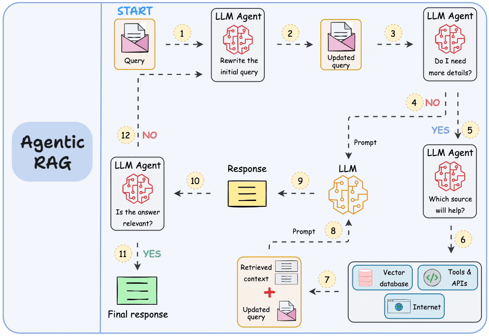

# Fastx-AI LLM RAG System


<p align="center" style="color: #eeeeee">RAG build on agents; gif: dailydoseofds</p>

## Introduction

In the rapidly evolving landscape of artificial intelligence, knowledge bases have emerged as a critical component for driving innovation and enabling intelligent decision-making. The **Fastx-AI LLM RAG System** is an open-source project designed to build a flexible, scalable, and easily accessible platform that provides robust support for developers and researchers.

The primary goal of the Fastx-AI LLM RAG System is to create an infrastructure that supports efficient knowledge retrieval and management by integrating multiple data sources, semantic analysis, and natural language processing technologies. This platform empowers developers to build context-aware intelligent applications more effectively, whether it be automated customer service systems, personalized recommendation engines, or complex decision support tools.

## Key Features

- **Multi-Source Integration**: Seamlessly integrate various data sources, including databases, APIs, and unstructured text.
- **Semantic Analysis**: Utilize advanced NLP techniques to understand and process natural language queries.
- **Scalability**: Designed to handle large volumes of data and high traffic loads.
- **Flexibility**: Easily customizable to fit specific use cases and requirements.
- **Open Source**: Foster rapid iteration and innovation through community collaboration.

## Architecture

The Fastx-AI LLM RAG System is built on a modular architecture, allowing for easy integration and extension. The core components include:

- **Data Ingestion**: Collect and preprocess data from various sources.
- **Knowledge Base**: Store and manage structured and unstructured data.
- **Query Engine**: Process user queries and retrieve relevant information.
- **NLP Module**: Perform semantic analysis and natural language understanding.
- **API Layer**: Provide RESTful APIs for seamless integration with other systems.

## Self Hosting

We are excited for you to deploy our application! Below are the steps to get started:

### Prerequisites

- **MySQL**: Ensure you are using the latest version of MySQL, as the project utilizes features like `JSON` and `ENUM`.
- **Zookeeper**: Required for distributed coordination and configuration management.
- **Seata Server**: Required for distributed transactions.
- **Redis**: Used for caching and session management.

**Note**: This is currently a development branch and should not be used in a production environment.

## Dependencies

The Fastx-AI LLM RAG System relies on several open-source libraries and frameworks:

- **Dubbo/Sentinel**: For service governance and flow control.
- **MyBatis/Plus/P6spy**: For database operations and SQL logging.
- **Spring/Boot**: For building the application framework.
- **Zookeeper**: For distributed coordination.
- **Redis/Redisson**: For caching and distributed locks.
- **Seata**: For distributed transactions.
- **AutoService/Annotation**: For code generation and annotations.

## Contributing

We welcome contributions from developers of all backgrounds to enhance this essential component of future AI applications by sharing code and expertise. To contribute, please follow these steps:

1. **Fork the Repository**: Fork the repository on GitHub.
2. **Create a Branch**: Create a new branch for your feature or bug fix.
3. **Submit a Pull Request**: Once your changes are ready, submit a pull request for review.

## Thanks For Open Sources

We would like to extend our gratitude to the following projects for their invaluable contributions:

- **Dubbo/Sentinel**
- **MyBatis/Plus/P6spy**
- **Spring/Boot**
- **Zookeeper**
- **Redis/Redisson**
- **Seata**
- **AutoService/Annotation**

Join us and let the Fastx-AI LLM RAG System become the cornerstone of your next intelligent application, helping to elevate AI technology to new heights.

## API Reference

The Fastx-AI LLM RAG System provides a RESTful API for seamless integration with other systems. The API endpoints are documented using Swagger, allowing developers to easily explore and interact with the system.

```shell
###
GET http://localhost:8082/info/all

###
POST http://localhost:8082/auth/user/createWithEmail
Content-Type: application/json

{
  "email": "x.stark.dylan@gmail.com",
  "password": "123456",
  "username": "starkdylan",
  "profileImageUrl": ""
}

###
POST http://localhost:8082/auth/user/loginWithEmail
Content-Type: application/json

{
  "email": "x.stark.dylan@gmail.com",
  "password": "e10adc3949ba59abbe56e057f20f883e"
}

###
POST http://localhost:8082/tool/platform/tool/exec
satoken: x.y.z.jwt.token generate by login or auth
Content-Type: application/json

{
  "toolCode": "openai.chat",
  "toolVersion": "1.0.0",
  "type": "llm-model",
  "input": {
    "config": {
      "apiKey": "sk-",
      "baseUrl": "https://x.com/v1"
    },
    "data": {
      "modelId": "gpt-4o-mini",
      "messages": [
        {
          "role": "user",
          "content": "hi"
        },
        {
          "role": "system",
          "content": "please answer in Chinese"
        }
      ]
    }
  }
}
```

## Others

#### 1. if you meet git ignored file not worked, please try

```shell
git rm -r --cached .
git add .
```

#### 2. now we only support storage with S3 protocol, so you need to config your minio or s3 server with the following:

```yaml
file:
  oss:
    domain: https://
    endpoint: https://
    bucket: 
    region: 
    access-key: 1
    access-secret: 2
```

and modified `web/src/main/resources/application-upload-example.yaml` to `application-upload.yaml`.

#### 3.about JAVA call python

you should follow this steps to setup env first.

```shell
1. open `knowledge-base-embedding` folder
2. create a conda enviroment use: conda create --name kbe python==3.12
3. pip install -r requirements.txt
4. open `platform-tool` folder, change workdir to `src/main/resources/python-script`
5. run: python image2vec.py "http://xxx.png"  to check image2vec
6. run: python text2vec.py "Hello World"  to check text2vec
7. run: python pdf2md.py "http://xxx.pdf" to check pdf2markdown
```

> noticed that we use `/opt/anaconda3/envs/kbe/bin/paddleocr` in `pdf2md.py`, if your paddleocr executable file not in this path, you should change this path in `pdf2md.py` manually.  
